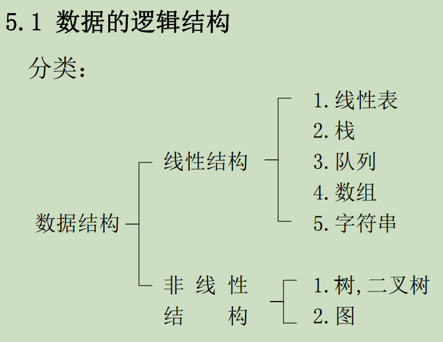

# 绪论
## 数据结构的定义
数据结构是一门研究非数值计算的程序设计问题中  
计算机的操作对象以及它们之间的关系和操作等相关问题的学科。
> 程序设计=数据结构+算法
## 基本概念和术语
1. 数据(data):所有能输入到计算机中并被计算机程序加工、处理
的符号的总称
2. 数据元素(data element):数据的基本单位。（元素、记录、结点、顶点）
3. 数据项(data item):是数据的不可分割的最小单位。如：姓名、年龄等。
一个数据元素可由一个或多个数据项组成。
4. 数据对象(data object):由性质相同(类型相同)的数据元素组成的集合。数据对象是数据的一个子集。
5. 数据结构的访问：
  *  顺序访问是指按照元素排列的顺序一个一个地访问每个元素。如链表就是一种典型的顺序访问式的数据结构。在访问链表中的元素时，需要从头开始依次遍历整个链表，不能直接跳到任意一个元素，因为链表中的元素地址不是连续的。
  * 而随机访问则是可以通过元素在内存中的物理地址计算的方式访问元素，这样相邻元素之间的地址是连续的。数组是一种很好的随机访问式的数据结构。因为数组分配的空间是连续的，不同元素之间的地址是相邻的，所以可以直接根据下标随机访问数组中的任意一个元素。
  * 总结来说，顺序访问是按照元素排列的顺序一个一个地访问每个元素，而随机访问是可以直接根据元素在内存中的物理地址计算的方式访问元素。

## 数据的逻辑结构与物理结构
1. 逻辑结构    
   
2. 物理结构：顺序存储、链表存储、索引存储、哈希存储

## 抽象数据类型（ADT）
ADT=(D,S,P)
- D：数据对象
- S：数据关系
- P：基本操作

## 算法与算法分析
### 算法的定义
算法是对特定问题求解步骤的一种描述，它是指令的有限序列，其中每一条指令表示一个或多个操作。
### 算法的特性
1. 有穷性
2. 确定性
3. 可行性
4. 输入
5. 输出
### 算法设计的要求
1. 正确性
2. 可读性
3. 健壮性

### 算法效率的度量方法
1. 事后统计方法
2. 事前分析估算方法
#### 影响算法效率的因素
-  硬件的速度
-  书写程序的语言
-  编译程序所生成目标代
码的质量
- 问题的规模。
在各种因素都不能确定的情况下，很难比较出算法的执
行时间。也就是说，使用执行算法的绝对时间来衡量算
法的效率是不合适的。  
为此，将上述各种与计算机相关的软、硬件因素都确定下来，这样一个特定算法的运行
工作量的大小就只依赖于问题的规模（通常用正整数n
表示），或者说它是问题规模的函数。
#### 时间复杂度
big O记法--渐进时间复杂度，同阶无穷大   
⭐**特定语句频度的计算**
> 步骤  
> 1. 判断循环层数,判断结束临界条件(如果直接看不好判断可能要设循环次数解方程)
> 2. 求和

exp
~~~
void func(int n){
   i = 1;k = 100;
   while(i < n){
      k = k + 1;
      i = i + 2;
   }
}
~~~
solution:
假设循环f(n)次，则$ i = 2f(n)+1< n ==> f(n)<=n / 2 - 1$ 

> Note:
> 估算的是操作执行次数而不是时间本身
> 不是时间复杂度高的时间一定长，要看执行规模

#### 算法的空间复杂度
1. 组成   
(1) 存储算法本身所占用的存储空间;  
(2) 算法的输入输出数据所占用的存储空间;  
(3) 算法在运行过程中临时占用的存储空间。  
2. 原地工作算法
   原地工作算法是指算法所需的辅助空间是常量。（而不是不需要任何额外的辅助空间）
