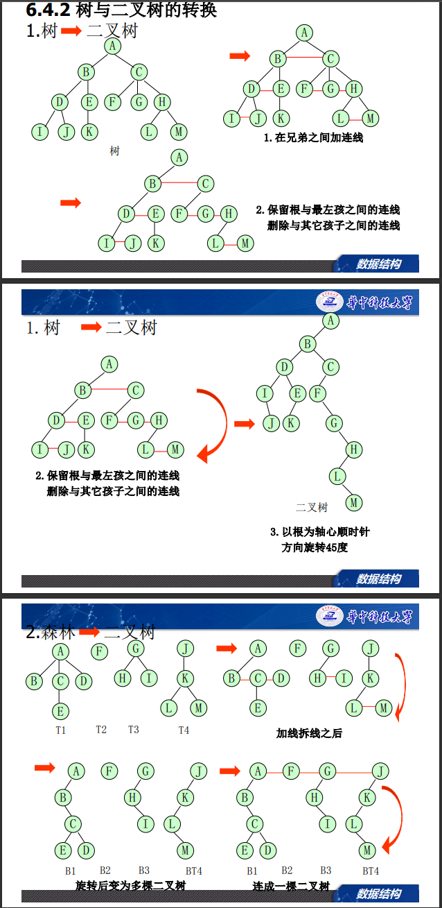
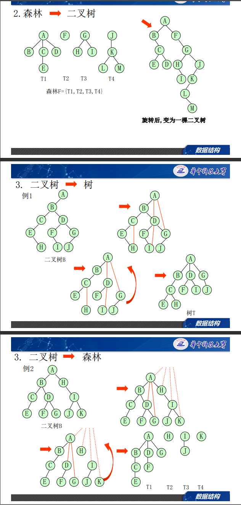

# 树

## 概念
* 子树：设T是有根树，a是T中的一个顶点，由a以及a的所有后裔（后代）导出的子图称为有向树T的子树。
* 层数：根的层数为1
* 深度：最大的层数
* 兄弟、双亲、子孙、祖先
* 度、内点（至少有一个孩子的结点）、叶子（度为0的结点）：
* m叉树：所有节点度不超过m的树
* 满m叉树：所有内点度都为m

## 树的表示法
* 树状
* 广义表
* 嵌套集合
* 凹入表（书目表）

## 二叉树的性质
* 二叉树区分左子树和右子树
* 第i层最多有__个结点
  $2^i - 1$
* 深度为k的二叉树最多有__个结点
  $2^k - 1$
* **对于有n个节点的二叉树，所有节点度数之和为n-1**
* **用二叉链表表示二叉树，总链域有2n,用的有n-1(每个节点，除了根节点都被一个链域指向)，空链域n+1**
* **叶子数=度为2的结点数+1**  
  *proof*:
  | degree|number| 
  |-------|------|
  |0    |n     |
  |1    |$n_1$ |
  |2    |$n_2$ | 

  

$1+2n_2+n_1=n_2+n_1+n \quad \Rightarrow \quad n=n_2+1$

- n个结点m叉树深度
  $\log_{2}(n+1)$

- 完全二叉树
  n个节点完全二叉树的深度  
  $\lfloor \log_2n \rfloor+1=\lceil \log_2(n+1) \rceil$

- 顺序编号的满2叉树1~n

  第i个结点的
  |name|value|
  |----|-----|
  |左子|2i|
  |右子|2i+1|
  |双亲|$\lfloor i/2 \rfloor$|
  |层号|$\lceil \log_{2}(i+1) \rceil$|

### 二叉树的存储方法
  - 顺序存储--根据第i个节点序号找孩子、双亲
  - 链式存储
     * 二叉链表 lchild,rchild
     * 三叉链表 parent,lchild,rchild  
  
### 二叉树的遍历
  * 前序遍历
  * 中序遍历
  * 后序遍历
  * 层序遍历
  * （非递归算法与递归算法的实现）   
  [遍历算法](https://www.cnblogs.com/kangna/p/11846154.html)   
💡时间和空间复杂度都为O(n)   
~~~
❓在二叉树中有两个结点m和n，如果m是n的祖先，使用 可找到从m到n的路径。
✅后序遍历，只有后序遍历，访问n时m仍在栈中，所以可以找到从m到n的路径。  
~~~
### [二叉树的创建](https://blog.csdn.net/weixin_42777504/article/details/103413314)

### [二叉树的线索化](https://blog.csdn.net/c18219227162/article/details/50188579)
💡看到一个精辟总结：前序求后继，后序求前驱，中序啥都行
~~~
❓二叉树线索化后，仍不能有效求解的问题是________。
A先序线索二叉树中求先序后继  

B中序线索二叉树中求中序后继  

C中序线索二叉树中求中序前驱   

D后序线索二叉树中求后序后继  
✅D后序两个子树都有，没空链域，放不了后继结点
~~~
### 二叉树的应用
  表达式（中缀前缀后缀） 

### 根据前+中序遍历 or 后+中遍历确定二叉树
  **前+后无法确定二叉树**
  思路：根据前序遍历确定根节点，然后在中序遍历中找到根节点，根节点左边的为左子树，右边的为右子树，然后递归的确定左右子树   
  [链接](https://blog.csdn.net/seveny_/article/details/82745802)   

## 树和森林
* 树的存储结构
  * 双亲表示法（数组表示）
  * 孩子表示法 lchild,rchild
  * 孩子链表表示法 孩子+孩子所有兄弟
  * 带双亲的孩子链表表示法
  * 孩子兄弟表示法（二叉链表）

### 树、森林、二叉树的转换

[遍历的对应关系](https://blog.csdn.net/weixin_44775255/article/details/120654059)
树  --前根遍历->对应二叉树的先序遍历 ---（也就是深度优先搜索）   
    --后根遍历->对应二叉树的中序遍历    
    无中根遍历    
森林--前序遍历->每一棵二叉树依次前序遍历  
    --中序遍历->依次对每一棵二叉树后序遍历   
💡数和二叉树是两种不同的树形结构  
💡将树转化为二叉树形态有多种  
💡设森林F中有三棵树，第一，第二，第三棵树的结点个数分别为M1，M2和M3。与森林F对应的二叉树根结点 的左子树中结点个数为M1-1，而右子树的结点个数为M2+M3  
### 哈夫曼树、哈夫曼编码
步骤：按结点权值排序，每次将最小的两个节点合成一个节点，直到只剩一个节点为止   
💡在哈夫曼树中，只存在度为0和2的结点，不存在度为1的节点  
~~~
❓给定哈夫曼树的权值个数，问有多少个节点？
✅权值个数=度为0的节点数=n
   度为2的节点数=n-1
   总节点数=2n-1
~~~