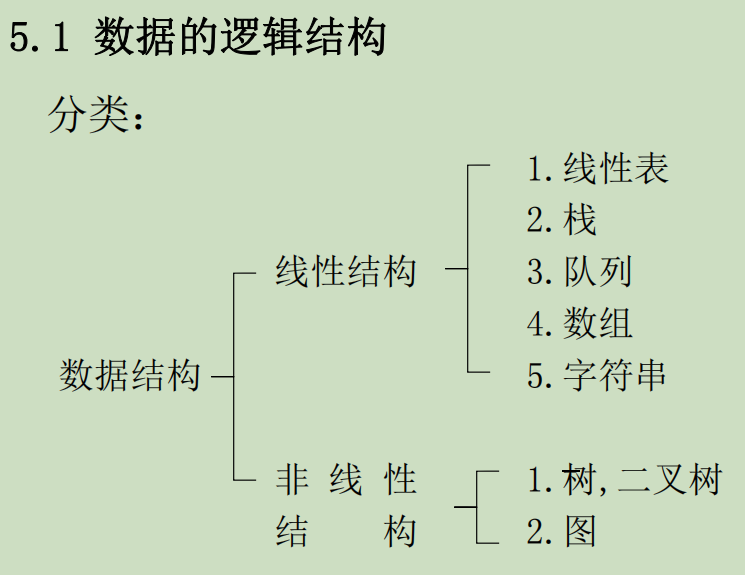

# 绪论
## 数据结构的定义
数据结构是一门研究非数值计算的程序设计问题中  
计算机的操作对象以及它们之间的关系和操作等相关问题的学科。
> 程序设计=数据结构+算法
## 基本概念和术语
1. 数据(data):所有能输入到计算机中并被计算机程序加工、处理
的符号的总称
2. 数据元素(data element):数据的基本单位。（元素、记录、结点、顶点）
3. 数据项(data item):是数据的不可分割的最小单位。如：姓名、年龄等。
一个数据元素可由一个或多个数据项组成。
4. 数据对象(data object):由性质相同(类型相同)的数据元素组成的集合。数据对象是数据的一个子集。
## 数据的逻辑结构与物理结构
1. 逻辑结构    
   {width=50% height=50%}
2. 物理结构：顺序存储、链表存储、索引存储、哈希存储

## 抽象数据类型（ADT）
ADT=(D,S,P)
- D：数据对象
- S：数据关系
- P：基本操作

## 算法与算法分析
### 算法的定义
算法是对特定问题求解步骤的一种描述，它是指令的有限序列，其中每一条指令表示一个或多个操作。
### 算法的特性
1. 有穷性
2. 确定性
3. 可行性
4. 输入
5. 输出
### 算法设计的要求
1. 正确性
2. 可读性
3. 健壮性

### 算法效率的度量方法
1. 事后统计方法
2. 事前分析估算方法
#### 影响算法效率的因素
-  硬件的速度
-  书写程序的语言
-  编译程序所生成目标代
码的质量
- 问题的规模。
在各种因素都不能确定的情况下，很难比较出算法的执
行时间。也就是说，使用执行算法的绝对时间来衡量算
法的效率是不合适的。  
为此，将上述各种与计算机相关的软、硬件因素都确定下来，这样一个特定算法的运行
工作量的大小就只依赖于问题的规模（通常用正整数n
表示），或者说它是问题规模的函数。
#### 时间复杂度
big O记法--渐进时间复杂度，同阶无穷大   
⭐**特定语句频度的计算**
> 步骤  
> 1. 判断循环层数,判断结束临界条件(如果直接看不好判断可能要设循环次数解方程)
> 2. 求和

exp
~~~
void func(int n){
   i = 1;k = 100;
   while(i < n){
      k = k + 1;
      i = i + 2;
   }
}
~~~
solution:
假设循环f(n)次，则$ i = 2f(n)+1< n ==> f(n)<=n / 2 - 1$ 

> Note:
> 估算的是操作执行次数而不是时间本身
> 不是时间复杂度高的时间一定长，要看执行规模

#### 算法的空间复杂度
1. 组成   
(1) 存储算法本身所占用的存储空间;  
(2) 算法的输入输出数据所占用的存储空间;  
(3) 算法在运行过程中临时占用的存储空间。  
2. 原地工作算法
   原地工作算法是指算法所需的辅助空间是常量。（而不是不需要任何额外的辅助空间）
