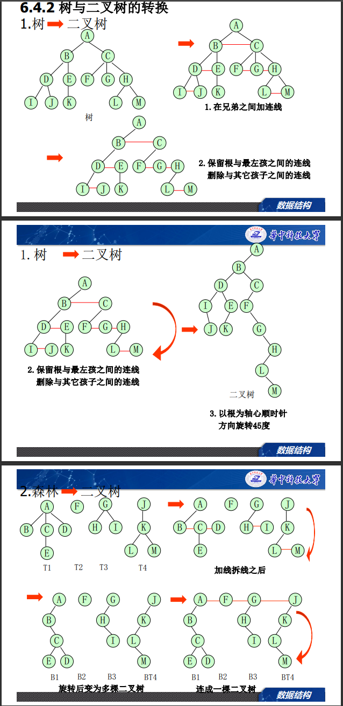
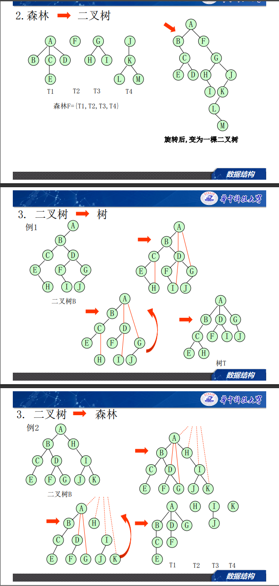

# 树

## 概念
* 子树：设T是有根树，a是T中的一个顶点，由a以及a的所有后裔（后代）导出的子图称为有向树T的子树。
* 层数：根的层数为1
* 深度：最大的层数
* 兄弟、双亲、子孙、祖先
* 度、内点（至少有一个孩子的结点）、叶子（度为0的结点）：
* m叉树：所有节点度不超过m的树
* 满m叉树：所有内点度都为m

## 树的表示法
* 树状
* 广义表
* 嵌套集合
* 凹入表（书目表）

## 二叉树的性质
* 二叉树区分左子树和右子树
* 第i层最多有$2^i - 1$个结点
* 深度为k的二叉树最多有$2^k - 1$个结点
* **叶子数=度为2的结点数+1**  
  *proof*:
  | degree|number| 
  |-------|------|
  |0    |n     |
  |1    |$n_1$ |
  |2    |$n_2$ | 
  $$
  1+2{n_2}+n_1=n_2+n_1+n
  ==>n=n_2+1
  $$
* n个结点m叉树深度$\log_{2} (n+1)$
* 顺序编号的满2叉树1~n
第i个结点的
   左子：2i
   右子：2i+1
   双亲：$\lfloor {i+1} \rfloor$ 
   层号：$\lfloor \log_{2}(i) \rfloor +1=\lceil \log_{2}(i+1) \rceil$ 
* 完全二叉树
  n个节点完全二叉树的深度
  $\lfloor \log_2n \rfloor+1=\lceil \log_2(n+1) \rceil$

### 二叉树的存储方法
  - 顺序存储--根据第i个节点序号找孩子、双亲
  - 链式存储
     * 二叉链表 lchild,rchild
     * 三叉链表 parent,lchild,rchild
### 二叉树的遍历
  * 前序遍历
  * 中序遍历
  * 后序遍历
  * 层序遍历
  * （非递归算法与递归算法的实现）
  [遍历算法](https://www.cnblogs.com/kangna/p/11846154.html)
### [二叉树的创建](https://blog.csdn.net/weixin_42777504/article/details/103413314)

### [二叉树的线索化](https://blog.csdn.net/c18219227162/article/details/50188579)

### 二叉树的应用
  表达式（中缀前缀后缀）

### 根据前+中序遍历 or 后+中遍历确定二叉树
  **前+后无法确定二叉树**
  思路：根据前序遍历确定根节点，然后在中序遍历中找到根节点，根节点左边的为左子树，右边的为右子树，然后递归的确定左右子树
  [链接](https://blog.csdn.net/seveny_/article/details/82745802)

## 树和森林
* 树的存储结构
  * 双亲表示法（数组表示）
  * 孩子表示法 lchild,rchild
  * 孩子链表表示法 孩子+孩子所有兄弟
  * 带双亲的孩子链表表示法
  * 孩子兄弟表示法（二叉链表）

### 树、森林、二叉树的转换

### 哈夫曼树、哈夫曼编码
按结点权值排序，每次将最小的两个节点合成一个节点，直到只剩一个节点为止